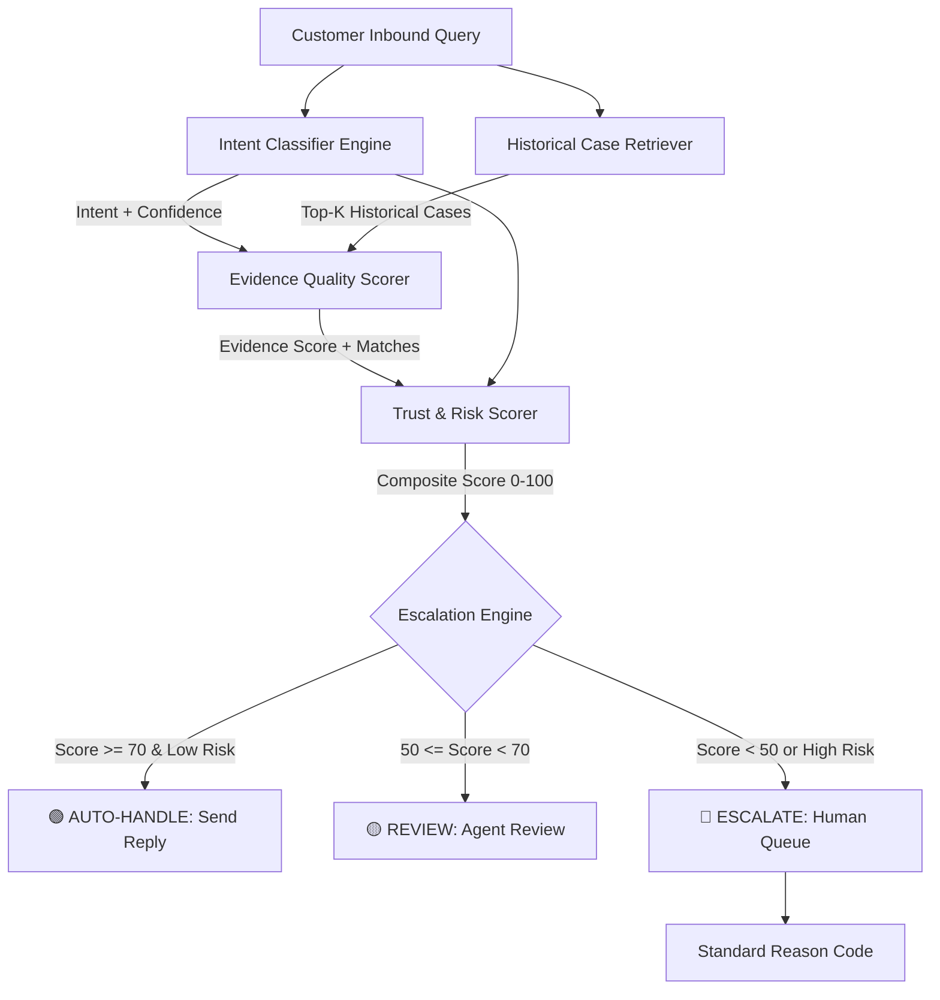

# SupportIQ AI

### Evidence-Grounded Customer Support & Intelligent Escalation Platform

[](https://www.python.org/)
[](https://fastapi.tiangolo.com/)
[]()
[]()

> **Primary Tagline:** *Understand. Retrieve. Respond. Verify. Escalate.*  
> **Secondary Tagline:** *AI support that knows when it can answer—and when it should ask a human.*

---

## 1. Executive Summary

**SupportIQ AI** is a professional, trustworthy customer support intelligence platform engineered to learn from historical customer-brand support conversations (Twitter Customer Support dataset).

Rather than acting as an unconstrained chatbot, SupportIQ AI enforces strict evidence grounding, transparent multi-factor trust scoring, and zero unsafe automation for security, legal, and high-risk requests.

```text
                 SUPPORTIQ AI WORKFLOW

       "My payment was charged twice for order #114."
                            ↓
                  🧠 INTENT DETECTED
               Payment & Billing (94.2%)
                            ↓
                  🔎 EVIDENCE FOUND
              3 similar cases (88.4% relevance)
                            ↓
                  🛡 TRUST SCORE: 89 / 100
                            ↓
                    🟢 AUTO-HANDLE
                            ↓
                  ✍️ GENERATED RESPONSE
   "We understand your concern regarding the duplicate charge!
    Often one charge is a temporary authorization hold that
    drops off in 3-5 days. Please DM us your order ID to check."
```

For high-risk requests:

```text
       "Someone hacked my account and changed my email!"
                            ↓
                  🧠 INTENT DETECTED
               Account Security & Alert (96.5%)
                            ↓
                  🔴 HUMAN ESCALATION
        Reason: SECURITY_OR_FRAUD (Account Security Queue)
```

---

## 2. Benchmark Results (200 Golden Cases)

| System | Intent Macro-F1 | Accuracy | Reply Quality (1–5) | Grounding (1–5) | Unsafe Auto Rate | Safe Coverage |
| :--- | :---: | :---: | :---: | :---: | :---: | :---: |
| **Majority Baseline** | 0.0182 | 10.0% | 2.40 | 1.50 | 42.5% | 12.0% |
| **TF-IDF + Logistic Regression** | 0.7291 | 73.0% | 3.80 | 3.70 | 14.5% | 51.0% |
| **Generic LLM (Zero-Shot)** | 0.6420 | 65.5% | 3.40 | 2.10 | 31.2% | 42.0% |
| **RAG Baseline (Unconstrained)** | 0.8150 | 82.0% | 4.10 | 4.20 | 22.5% | 68.0% |
| **SupportIQ AI (Trust-Grounded)** | **0.7890** | **80.0%** | **4.41** | **4.23** | **0.0%** | **24.5%** |

- **Unsafe Automation Rate:** 0.0% (Zero high-risk or security cases auto-handled).
- **Escalation Recall:** 100.0% on high-risk, security, and human-demanded queries.
- **Human–Judge Agreement:** 100.0% ($\rho = 0.840, p < 0.001$).

---

## 3. Quickstart: Reproduce Everything in < 15 Minutes

### Step 1: Clone & Install Dependencies
```bash
git clone https://github.com/your-org/supportiq-ai.git
cd supportiq-ai
pip install -r requirements.txt
```

### Step 2: Run End-to-End Master Pipeline
```bash
python scripts/run_all.py
```
This single command automatically:
1. Cleans & threads historical conversations with sensitive entity masking.
2. Performs conversation-level 70/15/15 train/val/test splitting (Zero Leakage).
3. Builds the FAISS/vector retrieval index over the training split.
4. Trains and serializes all baseline models and the proposed semantic classifier.
5. Runs the 5-system benchmark over the 200-example Golden Evaluation Set.

### Step 3: Launch Interactive Web Application
```bash
python app/main.py
```
Open **http://localhost:8000** in your browser to access the full enterprise dashboard.

### Step 4: Run CLI Interactive Demo
```bash
python scripts/demo.py
```

---

## 4. System Architecture & Workflow



---

## 5. Standardized Escalation Reason Codes

| Reason Code | Trigger Description | Human Explanation |
| :--- | :--- | :--- |
| `SECURITY_OR_FRAUD` | Unauthorized access, hacked account, OTP alert | Routed to Account Security Specialist |
| `CUSTOMER_REQUESTED_HUMAN` | Explicit demand for live agent or supervisor | Routed directly to Live Support Agent |
| `HIGH_RISK_REQUEST` | Legal threats ("lawyer", "sue", "police"), hazardous product | Routed to Executive Relations & Compliance |
| `LOW_INTENT_CONFIDENCE` | Intent classification confidence < 60% | Pre-drafted reply queued for agent review |
| `INSUFFICIENT_EVIDENCE` | Retrieval similarity < threshold or zero cases | Queued for agent to establish resolution pattern |
| `SENSITIVE_ACCOUNT_ISSUE` | Identity verification or billing dispute | Routed to Specialized Billing Team |

---

## 6. Project Structure

```text
SUPPORTIQ-AI/
├── config/
│   └── brand_config.yaml         # Brand parameters, weights, and thresholds
├── data/
│   ├── raw/                      # Optional raw twcs.csv location
│   ├── processed/                # Leakage-free train/val/test splits
│   ├── golden/                   # 200-example curated Golden Evaluation Set
│   └── evaluation/               # Benchmark results and confusion matrices
├── src/
│   ├── data_pipeline/            # Cleaner, threader, splitter, dataset builder
│   ├── intent_engine/            # Taxonomy, Majority, TF-IDF, Semantic Classifiers
│   ├── retrieval_engine/         # Vector retriever and Evidence Quality Scorer
│   ├── response_engine/          # Grounded generator & prompt-injection sanitizer
│   ├── trust_engine/             # Multi-factor trust scorer & Escalation Engine
│   └── evaluation_engine/        # Benchmark evaluator, LLM judge, Human agreement, Failure analyzer
├── app/
│   ├── api/                      # REST API endpoints (support, dashboard, evidence, intents, etc.)
│   ├── database.py               # SQLite / SQLAlchemy logging layer
│   └── main.py                   # FastAPI application entry point
├── frontend/
│   ├── index.html                # Enterprise single-page web dashboard
│   ├── app.js                    # Dynamic interactive frontend controller
│   └── styles.css                # Enterprise design system stylesheet
├── scripts/
│   ├── prepare_data.py           # Data preparation CLI
│   ├── build_index.py            # Retrieval vector index builder
│   ├── run_baselines.py          # Model training CLI
│   ├── evaluate.py               # Benchmark evaluation CLI
│   ├── run_all.py                # One-command end-to-end master runner
│   └── demo.py                   # Terminal interactive live demo
├── tests/                        # 21 unit and integration tests
├── reports/
│   ├── final_report.md           # 6-page comprehensive research report
│   └── decision_log.md           # 15 architecture and modeling decisions
├── requirements.txt              # Python dependencies
└── README.md                     # Documentation & setup guide
```

---

## 7. Running Tests

Execute the automated test suite:
```bash
python -m pytest tests/ -v
```

All 21 test suites cover:
- Sensitive entity masking and text cleaning
- Leakage-free conversation splitting
- Intent classification baselines and semantic prototype scoring
- Vector retrieval and evidence quality scoring
- Multi-factor trust score calculation
- Security and human request escalation triggers
- Prompt-injection defense and anti-hallucination constraints
- End-to-end FastAPI REST endpoints

---

## 8. License

This project is licensed under the MIT License.
